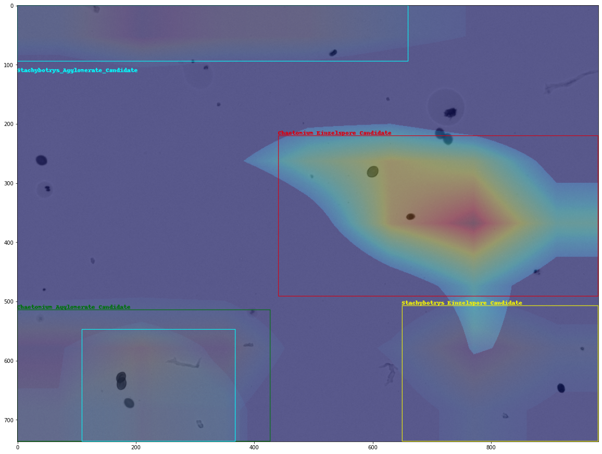
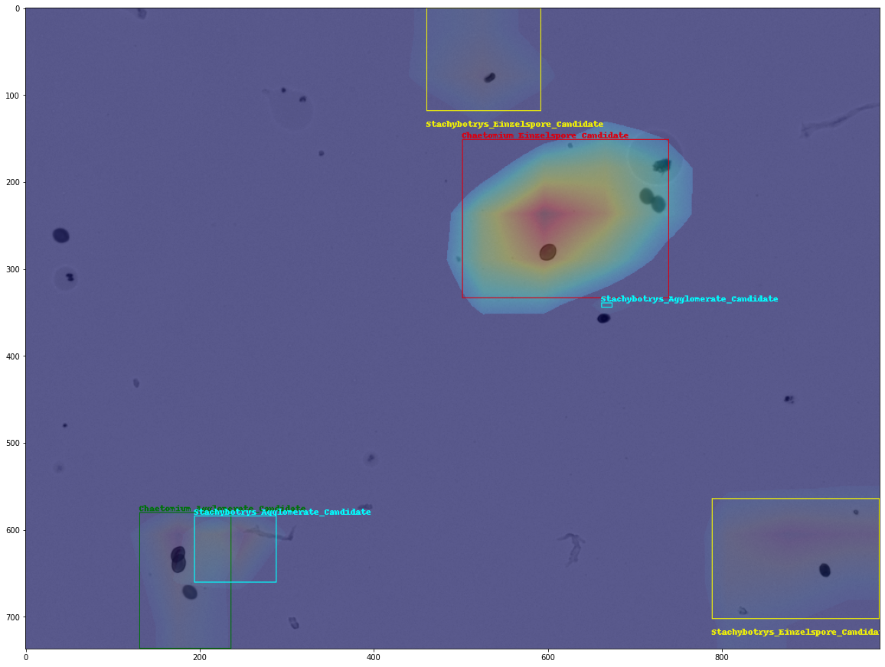
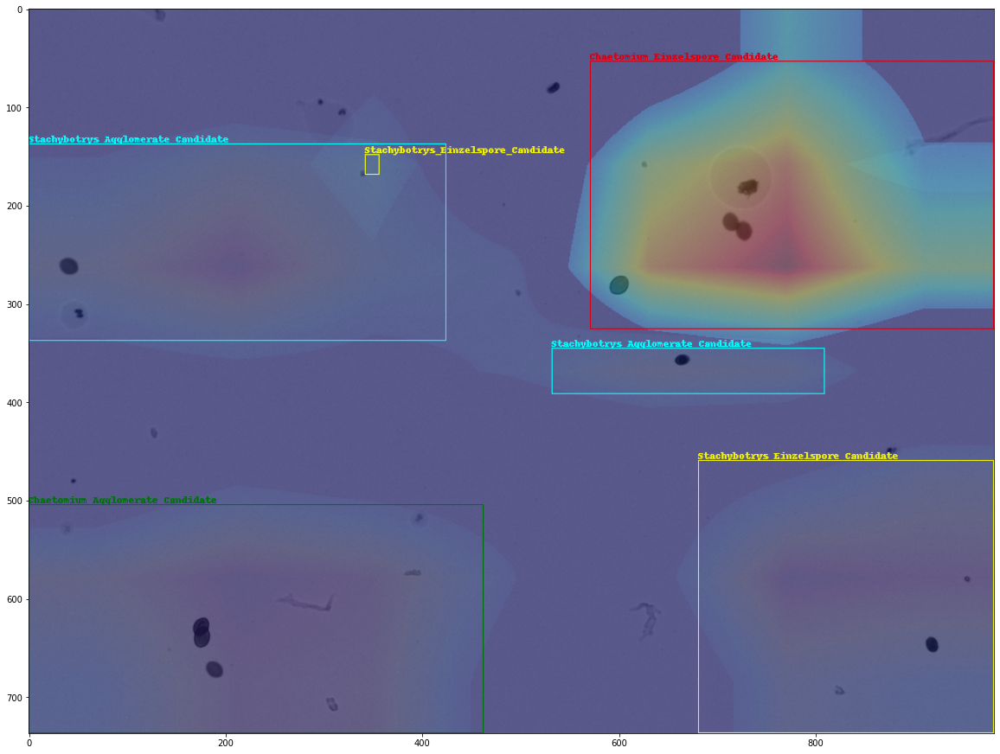
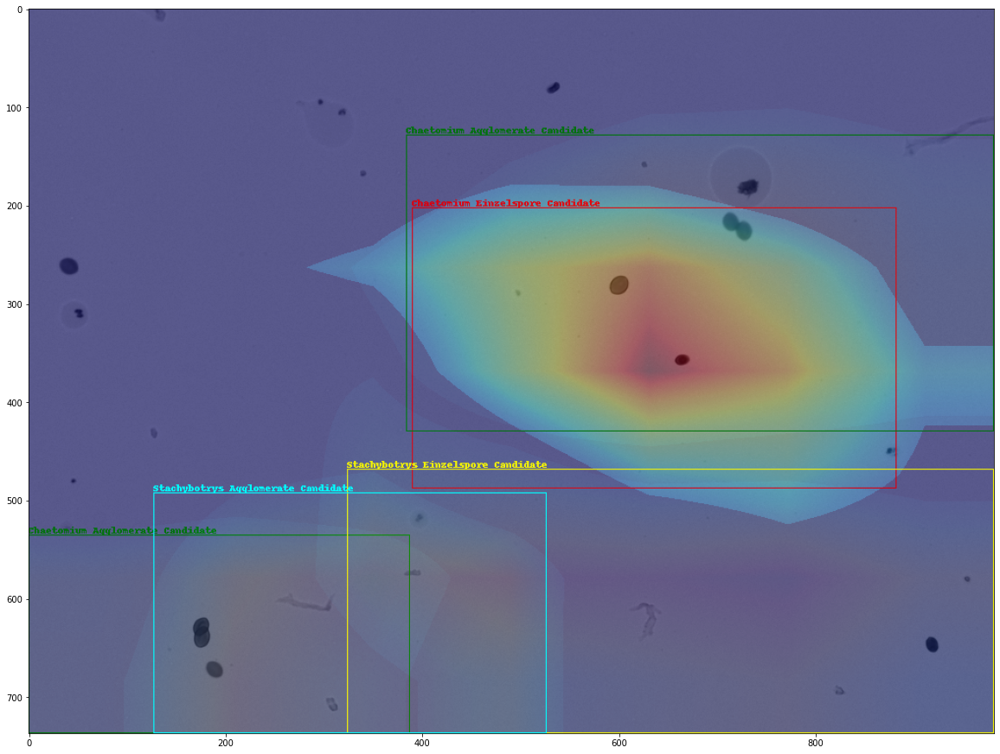
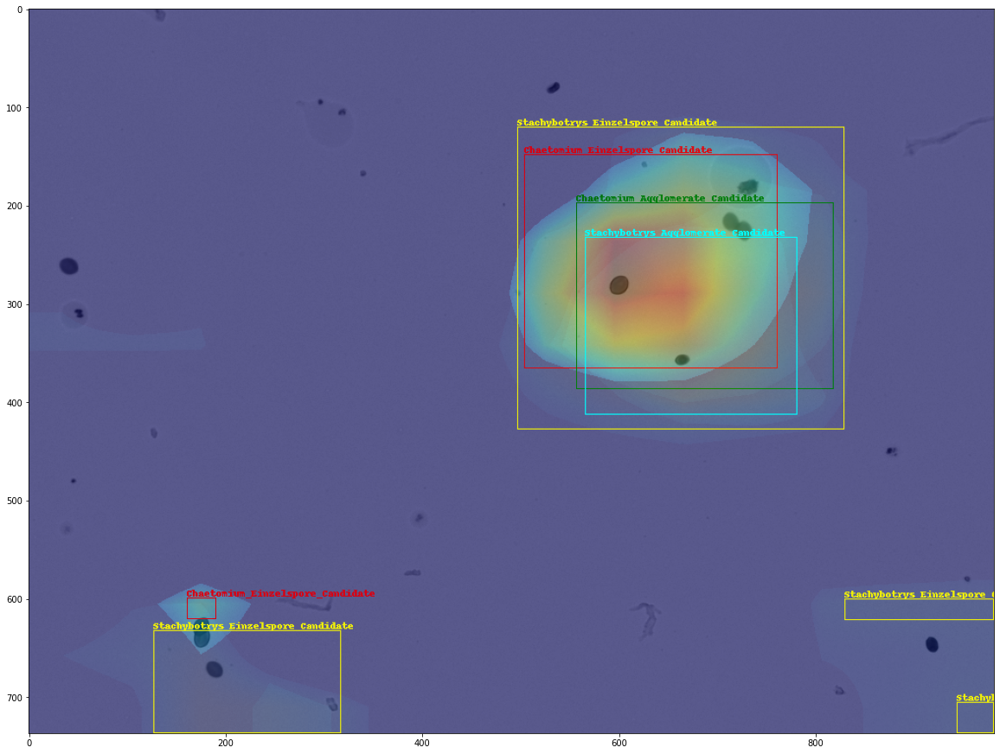
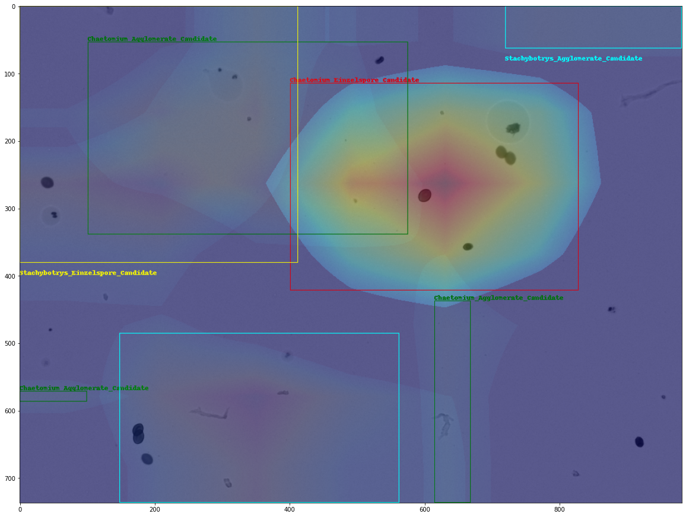

# X-Detector: Spore Detection with Uncertainty

# Disclaimer
This project is constructed as part of the course project of Computer Vision course at Hochschule Bonn-Rhein-Sieg. The repository acts as part of my individual submission under my username and student ID:
- dpham2s, 9038556 
All related concerns can be sent to the email address: duy.pham@smail.inf.h-brs.de.

# Motivation
- Motivated by localization test in visual explanation methods for classification deep learning convolutional neural network models, an object detection model can be shaped into a pure classification problem.
- This approach could provide an uncertainty map for every prediction in the image along with its bounding box.

# Methodology
- Firstly, to convert an object detection problem into a classification problem, the dataset must be converted accordingly. Images with objects' coordinates are used to constructed images with only one object of interest, the remaining objects are removed, until all objects in the ground truth object detection labels are covered.
- The resulting images are further augmented such that the coverage of objects' pixels must outnumber the background ones.
- A CNN classification model is then trained with the newly transformed dataset by transfer learning from their pretrained weights on ImageNet.
- The trained model is used to serve the explanation of the model to the question: Why should this image belong to this class of object? The explanation is then a saliency map of activated pixels given the being-querried class.
- Finally, The uncertainty map is thresholded and clustered into interesting regions by DBSCAN method to localize the instances belonging to the class. Then, the corresponding bounding box for each instance could be extracted.

# How to reproduce the probject?
## Requirements
The project requires the preinstallation of the following Python packages:
- torch
- torchvision
- pandas
- numpy
- scikit-learn
- matplotlib
- PIL
- OpenCV

## Steps to reproduce
This project uses the Spore Dataset under the scope of the project requirement. However, any other datasets could be used.
### Preprocessing the dataset to classification problem
- Preprocessing steps such as removing irrelevant objects and multiplying it are summarized in the section `Write new classification dataset` [here](./examples/CV_Project_PreprocessingExample.ipynb)
- After preparting the new structure of the dataset, training steps are instructed [here](./examples/CV_Project_TrainingExample.ipynb)
- Querrying the trained model with two Class Activation Mapping methods (XGrad-CAM and Grad-CAM++) are instructed step by step [here](./examples/CV_Project_SaliencyMap_Example.ipynb)

# Results
## Visualization of the resulting detection
### XGrad-CAM for ResNet50
#### Fine-tuning only dense layers

#### Fine-tuning the last two convolutional layers and dense layers

### XGrad-CAM for VGG16
#### Fine-tuning only dense layers

#### Fine-tuning the last two convolutional layers and dense layers

### XGrad-CAM for DenseNet169
#### Fine-tuning only dense layers

#### Fine-tuning the last two convolutional layers and dense layers

### XGrad-CAM for MobileNetv2
#### Fine-tuning only dense layers

#### Fine-tuning the last two convolutional layers and dense layers

### Grad-CAM++ for ResNet50
#### Fine-tuning only dense layers

#### Fine-tuning the last two convolutional layers and dense layers

### Grad-CAM++ for VGG16
#### Fine-tuning only dense layers

#### Fine-tuning the last two convolutional layers and dense layers

### Grad-CAM++ for DenseNet169
#### Fine-tuning only dense layers

#### Fine-tuning the last two convolutional layers and dense layers

### Grad-CAM++ for MobileNetv2
#### Fine-tuning only dense layers

#### Fine-tuning the last two convolutional layers and dense layers

## Test processing time for one image

| Methods  | Processing Time (seconds) |
| ------------- | ------------- |
| XGrad-CAM on ResNet50  | 5.94  |
| XGrad-CAM on VGG16  | 4.98  |
| XGrad-CAM on DenseNet169  | 6.22  |
| XGrad-CAM on MobileNetv2  | 5.62  |
| Grad-CAM++ on ResNet50  | 6.54  |
| Grad-CAM++ on VGG16  | 4.88  |
| Grad-CAM++ on DenseNet169  | 5.85  |
| Grad-CAM++ on MobileNetv2  | 6.91  |

## Test performance over all classes
### Fine-tuning only dense layers
| Methods  | mAP@0.05 | mAP@0.15 | mAP@0.25 | mAP@0.5
| ------------- | ------------- | ------------- | ------------- | ------------- |
| XGrad-CAM on ResNet50  | 0.00025 | 0 | 0 | 0 |
| XGrad-CAM on VGG16  | 0.01 | 0.002 | 0.00053 | 0 |
| XGrad-CAM on DenseNet169  | 0.00018 | 0.000013 | 0.000013 | 0 |
| XGrad-CAM on MobileNetv2  | 0.00092 | 0 | 0 | 0 |
| Grad-CAM++ on ResNet50  | 0.00029  | 0.00002 | 0 | 0 |
| Grad-CAM++ on VGG16  | 0.0043 | 0.00033 | 0.000009 | 0 |
| Grad-CAM++ on DenseNet169  | 0.0002 | 0.00002 | 0| 0 |
| Grad-CAM++ on MobileNetv2  | 0.0002 | 0.000004| 0 | 0 |
### Fine-tuning the last two convolutional layers and dense layers
| Methods  | mAP@0.05 | mAP@0.15 | mAP@0.25 | | mAP@0.5
| ------------- | ------------- | ------------- | ------------- | ------------- |
| XGrad-CAM on ResNet50  | 0.00043 | 0.0000028 | 0 | 0 |
| XGrad-CAM on VGG16  | 0.018 | 0.0026 | 0.00025 | 0 |
| XGrad-CAM on DenseNet169  | 0.0063 | 0.0000065 | 0.0000065 | 0 |
| XGrad-CAM on MobileNetv2  | 0.001 | 0.000028 | 0 | 0|
| Grad-CAM++ on ResNet50  | 0.0009  | 0 | 0 | 0 |
| Grad-CAM++ on VGG16  | 0.0083 | 0.00058 | 0.000035 | 0.0000025|
| Grad-CAM++ on DenseNet169  | 0.0003 | 0.00002 | 0.000007 | 0 |
| Grad-CAM++ on MobileNetv2  | 0.0003 | 0.000005| 0.000005 | 0 |
